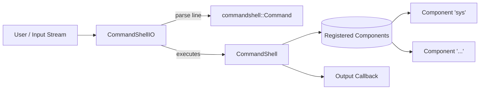
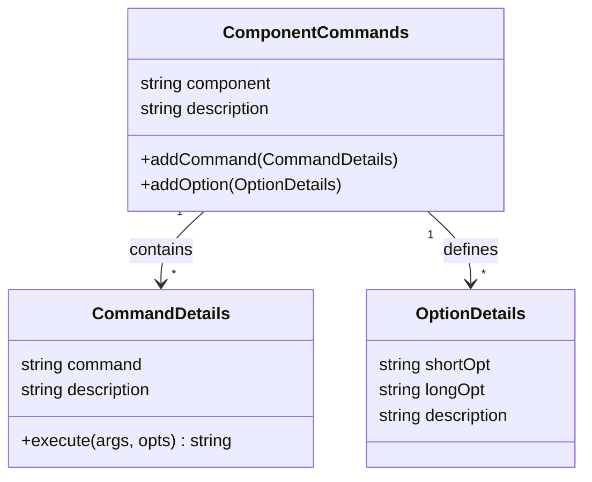

# CommandShell

Lightweight C++17 library for composing simple, testable command interfaces. Register components and their commands, then execute parsed input through a small IO helper that plugs into your app or UI.
This project is created with an embedded use cases in mind but it is not neccessary very optimized, specially in memory usage. It was important for me to use some C++ practices here.

Note on embedded targets:
- This library is not optimized for very small microcontrollers (RAM/flash constrained) and may not compile or run on boards like Arduino Uno/Nano.
- It has been tested primarily on ESP32-class devices. Use on other MCUs at your own discretion.

[](https://github.com/MohammadMokhalled/CommandShell/actions/workflows/ci-test.yml)

## Features
- Simple component/command model with arguments and options
- Built‑in contextual help: `help list`, `help <component> [command]`, or `<component> help [command]`
- Minimal IO layer (`CommandShellIO`) for prompt/echo/callback output
- CMake build with GoogleTest unit tests
- Cross‑platform C++17 (MSVC, GCC, Clang)

## Code Components Overview

- **CommandShell:** Think of it as the engine of the command shell. It stores the commands and components and execute the correct command based on the input.
- **CommandShellIO:** This is the class that can receive strings and characters and parse them at the end of the line to call the CommandShell commands. It is implemented separately to be able to handle multiple instances at the same time, e.g. UART1, UART2 and Ethernet.



- **Component:** Component can be thought of as each part, service, or component of the code. For example, for handling an LED in some firmware, the `led` can be the component.
- **Command:** Each component can have multiple commands. For example in the `led` component, `on` and `off` can be the commands. 




## Quick Start
Prerequisites:
- CMake >= 3.14
- A C++17 compiler (MSVC/Clang/GCC)

Build and run tests:
```bash
cmake -S . -B build
cmake --build build
ctest --test-dir build
```

Build samples (optional):
```bash
cmake -S . -B build -DBUILD_SAMPLES=ON
cmake --build build
```

## Usage Example
### 1. CommandShell initialization
Register a component with commands and execute them through `CommandShell`.

```cpp
#include "CommandShell.hpp"
#include "CommandTypes.hpp"
using namespace commandshell;

ComponentCommands sys{"sys", "System commands"};
sys.addCommand(CommandDetails{
    "echo", "Echo arguments",
    [](const std::vector<std::string>& args, const std::vector<std::string>&){
        std::string out; 
        for (size_t i=0;i<args.size();++i)
        { 
            if(i) 
                out+=' '; 
            
            out+=args[i]; 
        }
        out += '\n'; return out;
    }
});

CommandShell shell;
shell.registerComponent(sys);

Command cmd; cmd.component = "sys"; cmd.command = "echo"; cmd.arguments = {"hello", "world"};
auto out = shell.executeCommand(cmd); // "hello world\n"
```

### 2. CommandShellIO initialization
`CommandShellIO` wires user input to `CommandShell` with an output callback and optional input echo. `CommandShellIO` provides a prompt/echo layer and callback-based output suitable for desktop apps or embedded UIs.

```cpp
CommandShellIO io(shell, /*echoInput=*/false, /*promptText=*/std::string("cmd> "));

// Output goes to your UI/log (stdout here)
io.setOutputCallback([](const std::string& out) {
    std::cout << out;
}); 

// Feed complete line (must include \n or \r) to trigger parsing/execution
io.input(std::string("help list\n")); // prints components list

// Or feed in chunks; command executes when a newline arrives
io.input(std::string("sys echo"));
io.input(std::string(" hello"));
io.input(std::string("\n"));         // executes: sys echo hello -> "hello\n"

// To echo user keystrokes via callback, construct with echoInput=true
CommandShellIO ioEcho(shell, /*echoInput=*/true);
ioEcho.setOutputCallback([](const std::string& s){ std::cout << s; });
ioEcho.input(std::string("sample about\n"));
```

## Project Layout
- `src/` library sources and public headers (`CommandShell.hpp`, `CommandShellIO.hpp`, `CommandTypes.hpp`)
- `tests/` GoogleTest unit and integration tests
- `examples/` example applications (see `examples/desktop-sample`)
- `.github/workflows/ci-test.yml` GitHub Actions build + test

## Samples
- `desktop-sample`: minimal terminal app showcasing `CommandShell` + `CommandShellIO`. Enable with `-DBUILD_SAMPLES=ON` and run the produced `desktop-sample` binary. See `examples/desktop-sample/README.md`.

## Development
- Enable tests with `-DBUILD_TESTS=ON` (default in this repo)
- GCC/Clang use `-Wall -Wextra -Wpedantic -Werror`; MSVC uses `/W4`
- TODO: add `CONTRIBUTING.md`

## Versioning and Changelog
TODO

## License
MIT License. See `LICENSE` for details.
